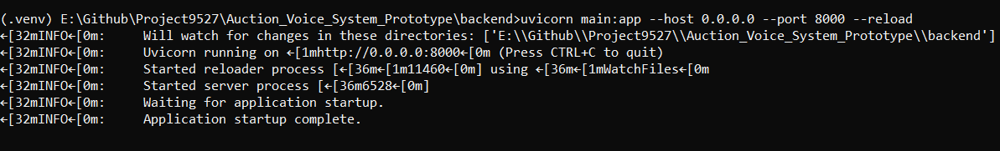
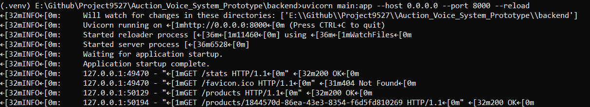

# Create Virtual Environment

```bash
python3 -m venv .venv
```

# Activate Virtual Environment
## On Windows
```bash
.\.venv\Scripts\activate
```
## On Linux/MacOS
```bash
source ./.venv/bin/activate
```
# Install Dependencies/Packages
```bash
pip install -r .\backend\requirements.txt
```

# Run backend Server
```bash
cd backend
uvicorn main:app --host 0.0.0.0 --port 8000 --reload
```

# Screenshot

